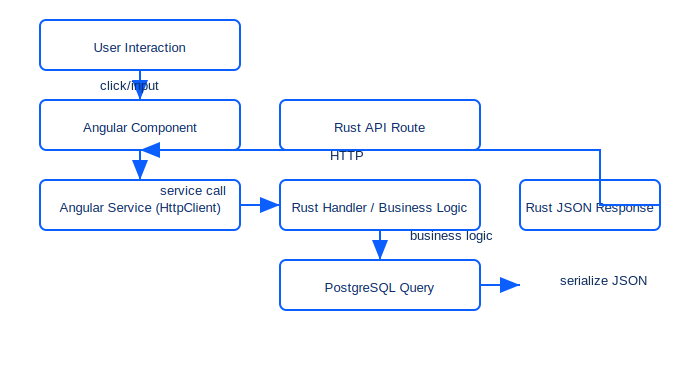

# Angular UI Feature — Component + Service

## 1) Angular UI Feature Explanation (Component + Service)

- **Component created:** `ProductListComponent` — a simple product list UI that displays items returned from the backend and allows creating a new product.
- **How the component handles user interaction:** The component exposes an input for product `name` and `qty` and a button bound to an `add()` method. Clicking the button calls the component method which uses the service to POST a new product; the component also loads products on `ngOnInit()` and shows loading/error state.
- **How the Angular service uses `HttpClient` to call a Rust API:** `ProductService` wraps `HttpClient` and exposes `getItems()` (GET `/api/items`) and `createItem()` (POST `/api/items`) methods. These methods return typed `Observable<T>` results so the component can subscribe and react to results.
- **How data returned from the Rust backend updates the UI:** The component subscribes to the service observables; on success it assigns the returned typed data to the component state (`items`) and Angular automatically re-renders the template. On create success the returned item is pushed into the `items` array so the list updates immediately.

Embed this explanation in your PR description or README so reviewers can map UI behavior to backend routes.

## 2) End-to-End Frontend → Backend Flow Diagram



Textual flow:
User Interaction
  ↓
Angular Component
  ↓
Angular Service (HttpClient)
  ↓
Rust API Route
  ↓
Rust Handler + Business Logic
  ↓
PostgreSQL Query (if applicable)
  ↓
Rust JSON Response
  ↓
Angular Component Re-renders UI

## 3) Code Implementation (Component + Service)

Files added in this PR (examples you can drop into an Angular project):

- `conceptKlarity/angular/product.service.ts`
- `conceptKlarity/angular/product-list.component.ts`
- `conceptKlarity/angular/product-list.component.html`

`product.service.ts` (typed, uses `HttpClient`):

```ts
import { Injectable } from '@angular/core';
import { HttpClient } from '@angular/common/http';
import { Observable } from 'rxjs';

export interface Product { id: number; name: string; qty: number }

@Injectable({ providedIn: 'root' })
export class ProductService {
  private base = '/api/items';
  constructor(private http: HttpClient) {}

  getItems(): Observable<Product[]> {
    return this.http.get<Product[]>(this.base);
  }

  createItem(payload: { name: string; qty: number }): Observable<Product> {
    return this.http.post<Product>(this.base, payload);
  }
}
```

`product-list.component.ts`:

```ts
import { Component, OnInit } from '@angular/core';
import { ProductService, Product } from './product.service';

@Component({
  selector: 'app-product-list',
  templateUrl: './product-list.component.html'
})
export class ProductListComponent implements OnInit {
  items: Product[] = [];
  newName = '';
  newQty = 1;
  loading = false;
  error = '';

  constructor(private svc: ProductService) {}

  ngOnInit(): void {
    this.load();
  }

  load(): void {
    this.loading = true;
    this.svc.getItems().subscribe({
      next: (data) => { this.items = data; this.loading = false; },
      error: () => { this.error = 'Failed to load items'; this.loading = false; }
    });
  }

  add(): void {
    if (!this.newName) { this.error = 'Name required'; return; }
    this.loading = true;
    this.svc.createItem({ name: this.newName, qty: this.newQty }).subscribe({
      next: (item) => { this.items.push(item); this.newName = ''; this.newQty = 1; this.loading = false; },
      error: () => { this.error = 'Create failed'; this.loading = false; }
    });
  }
}
```

`product-list.component.html`:

```html
<div class="product-list">
  <h3>Products</h3>
  <div *ngIf="loading">Loading...</div>
  <div *ngIf="error" class="error">{{ error }}</div>
  <ul>
    <li *ngFor="let p of items">{{ p.name }} — {{ p.qty }}</li>
  </ul>

  <div class="new-item">
    <input [(ngModel)]="newName" placeholder="Name" />
    <input type="number" [(ngModel)]="newQty" />
    <button (click)="add()">Add</button>
  </div>
</div>
```

Notes:
- Ensure your Angular module imports `HttpClientModule` and `FormsModule` to use `HttpClient` and `ngModel`.
- The service expects the Rust backend to expose `GET /api/items` returning `Product[]` and `POST /api/items` returning the created `Product`.

Install / run (example):

```bash
cd conceptKlarity/angular
npm install
# If you have Angular CLI installed globally, run:
npm start
```

## 4) Reflection

Using components and services makes Angular apps scalable by enforcing separation of concerns: components focus on presentation and user interaction while services handle data access and business logic. This modularity improves reusability, testability, and maintainability because services can be injected into multiple components and tested in isolation.
