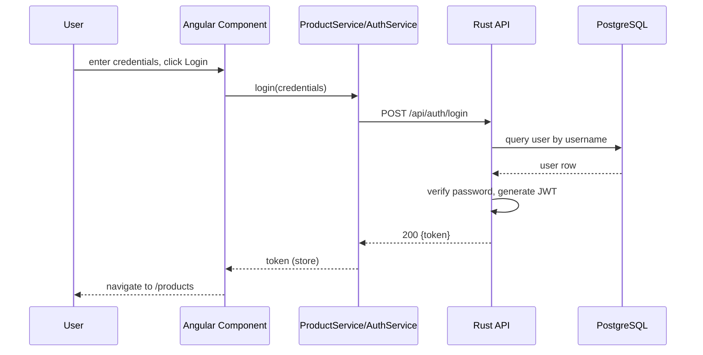
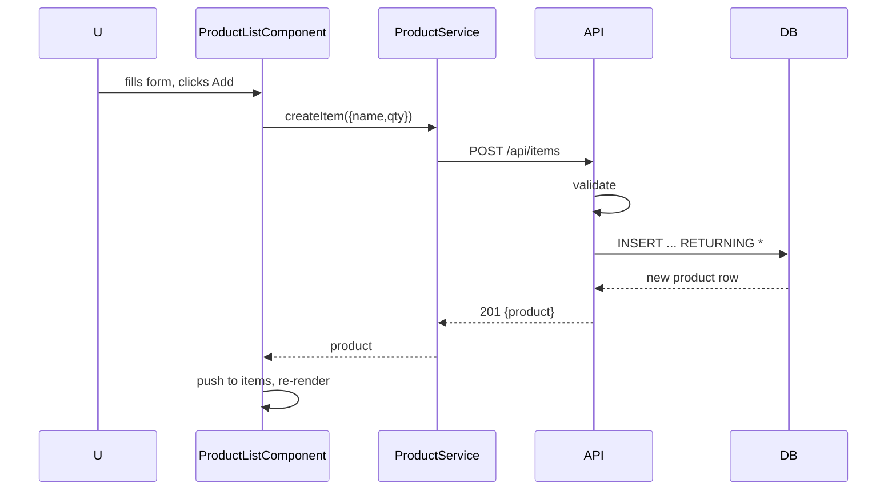
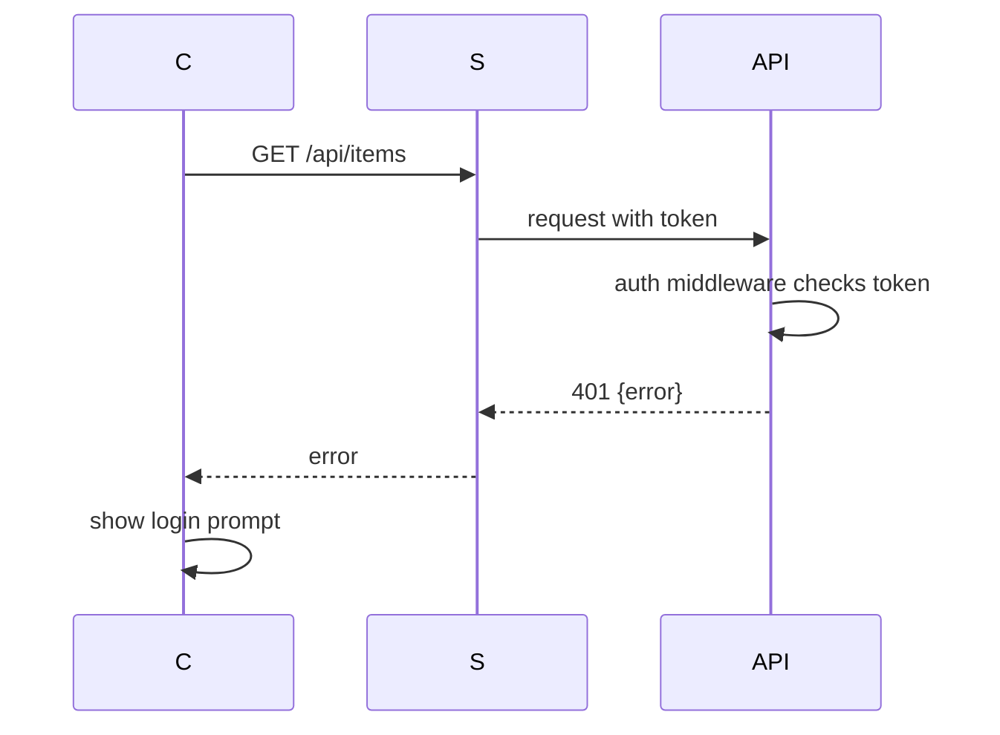

# Low-Level Design (LLD) — Angular + Rust Web Project

This LLD converts the HLD into an implementation-ready blueprint for developers. It targets an Angular frontend and a Rust backend (Actix Web or Axum) with PostgreSQL (SQLx or SeaORM).

## 1. Module & Feature Breakdown

A. Frontend (Angular)

- App structure (feature modules)
  - CoreModule: singleton services (AuthService, ApiService), interceptors (AuthInterceptor), shared guards
  - SharedModule: shared components (LoadingSpinner, ErrorBanner), pipes, directives
  - ProductsModule: components and services for product management
  - AuthModule: login/register components and services
  - AppRoutingModule: top-level routes and lazy-loading config

- Feature components (ProductsModule)
  - `ProductListComponent`
    - Purpose: list products and provide create UI
    - Inputs: none
    - Outputs: emits `productCreated` event (Product)
    - UI interactions: initial load, add-product form (name, qty), retry button on error
    - Data required: Product[]
    - Service: `ProductService.getItems()`, `ProductService.createItem()`
    - Loading/Error states: `loadingList`, `creating`, `listError`, `createError`

  - `ProductCardComponent`
    - Purpose: display single product and actions (edit, delete)
    - Inputs: `@Input() product: Product`
    - Outputs: `edit` and `delete` events
    - Service: none (parent handles API)

  - `ProductEditModalComponent`
    - Purpose: edit existing product (name, qty)
    - Inputs: `product` object
    - Outputs: `save` event with updated Product
    - Service: none (parent calls ProductService)

- Services
  - `ProductService`
    - Methods: `getItems(): Observable<Product[]>`, `getItem(id:number): Observable<Product>`, `createItem(payload): Observable<Product>`, `updateItem(id, payload): Observable<Product>`, `deleteItem(id): Observable<void>`
    - Uses `HttpClient` and base URL `/api/items`

  - `AuthService`
    - Methods: `login(credentials): Observable<AuthResponse>`, `logout()`, `getToken()`, `isAuthenticated()`
    - Stores JWT in secure storage (prefer HttpOnly cookie via backend, fallback: localStorage)

- Routing & Guards
  - Routes (AppRoutingModule)
    - `/login` — LoginComponent
    - `/products` — lazy-load ProductsModule, guarded by `AuthGuard`
  - `AuthGuard` checks `AuthService.isAuthenticated()` and redirects to `/login`.

- State-handling approach
  - Use RxJS Subjects/BehaviorSubjects inside services for local reactive state.
  - Example: `ProductService.items$ = new BehaviorSubject<Product[]>([])` updated after CRUD calls.
  - For large-scale apps, swap to NgRx in ProductsModule; for this project RxJS-based service state is sufficient.

B. Backend (Rust — Actix Web or Axum)

- High-level modules
  - api::auth — auth handlers (login, refresh, logout)
  - api::products — product CRUD handlers
  - db — database layer (repositories) using SQLx or SeaORM
  - models — request/response/domain structs (serde Serialize/Deserialize)
  - errors — common error types mapped to HTTP responses
  - server / main — routing setup and middleware (logger, auth middleware)

- Example endpoints (Products)
  - GET /api/items
  - POST /api/items
  - GET /api/items/{id}
  - PUT /api/items/{id}
  - DELETE /api/items/{id}

For each endpoint, detailed API specifications are provided in Section 3.

## 2. Data Flow Mapping (Detailed)

Example: Create Product (UI -> DB -> UI)

1. User clicks Add in `ProductListComponent` (form submit)
2. Component calls `ProductService.createItem({name, qty})`
3. `ProductService` issues POST `/api/items` via `HttpClient` with JSON body
4. Rust router matches POST `/api/items` and dispatches to `create_item_handler`
5. Handler: deserialize JSON into `CreateItemRequest` struct, run validation rules
6. Handler calls `db::products::insert_item(pool, &req)` which executes SQLx query or SeaORM active model insert
7. DB returns inserted row as `Product` struct
8. Handler returns HTTP 201 with JSON body `ProductResponse`
9. Angular service receives response Observable, component subscribes and pushes new item to `items$` BehaviorSubject; UI re-renders

Include similar flows for Read (list), Update (PUT), Delete (DELETE) and Auth (login -> token issuance -> guarded routes).

## 3. API Specifications (Full Contracts)

Common types (Rust/TS):

- Product (shared shape)
  - id: integer (server-generated)
  - name: string
  - qty: integer

- AuthResponse
  - token: string (JWT)
  - expires_at: string (ISO8601)

Endpoints:

1) List products
- URL: `/api/items`
- Method: GET
- Request body: none
- Response (200):

  ```json
  [ { "id": 1, "name": "Widget", "qty": 12 } ]
  ```
- Errors: 401 Unauthorized (no/invalid token)

2) Create product
- URL: `/api/items`
- Method: POST
- Request struct (Rust):

  ```rust
  #[derive(Deserialize)]
  struct CreateItemRequest { pub name: String, pub qty: i32 }
  ```

- Validation:
  - name: non-empty, max 255 chars
  - qty: >= 0, <= 100000

- Example request:

  ```json
  { "name": "New product", "qty": 5 }
  ```

- Success response (201):

  ```json
  { "id": 2, "name": "New product", "qty": 5 }
  ```

- Error responses:
  - 400 Bad Request: validation errors (body: { "error": "name required" })
  - 401 Unauthorized
  - 500 Internal Server Error

Handler logic flow (create):
  - Deserialize -> validate -> call repository insert -> map DB row to ProductResponse -> return 201

SQLx query example:

  ```sql
  INSERT INTO products (name, qty) VALUES ($1, $2) RETURNING id, name, qty, created_at
  ```

3) Get product
- URL: `/api/items/{id}`
- Method: GET
- Response 200: Product JSON
- Errors: 404 Not Found, 401 Unauthorized

4) Update product
- URL: `/api/items/{id}`
- Method: PUT
- Request struct: `UpdateItemRequest { name: Option<String>, qty: Option<i32> }`
- Validation: same as create when value present
- Success: 200 with updated Product
- Errors: 400, 401, 404, 500

5) Delete product
- URL: `/api/items/{id}`
- Method: DELETE
- Success: 204 No Content
- Errors: 401, 404

6) Auth — Login
- URL: `/api/auth/login`
- Method: POST
- Request: `{ "username": "...", "password": "..." }`
- Validation: username/password non-empty
- Success (200):

  ```json
  { "token": "<jwt>", "expires_at": "2026-03-07T12:00:00Z" }
  ```

- Errors: 401 Invalid credentials

Error format (consistent):

```json
{ "error": "short message", "details": { "field": "message" } }
```

## 4. Database Schema (Field-Level)

Primary tables:

Table: users
- id: SERIAL PRIMARY KEY
- username: TEXT UNIQUE NOT NULL
- password_hash: TEXT NOT NULL
- role: TEXT NOT NULL DEFAULT 'user'
- created_at: TIMESTAMP WITH TIME ZONE DEFAULT now()

Table: products
- id: SERIAL PRIMARY KEY
- name: TEXT NOT NULL
- qty: INTEGER NOT NULL DEFAULT 0
- created_at: TIMESTAMP WITH TIME ZONE DEFAULT now()
- updated_at: TIMESTAMP WITH TIME ZONE

Indexes & constraints:
- `users.username` unique
- `products(name)` index if frequent search by name

Relationships:
- No direct FK between products and users for this app; if ownership required add `owner_id: INT REFERENCES users(id)`

Migration example (Postgres SQL):

```sql
CREATE TABLE users (
  id SERIAL PRIMARY KEY,
  username TEXT NOT NULL UNIQUE,
  password_hash TEXT NOT NULL,
  role TEXT NOT NULL DEFAULT 'user',
  created_at TIMESTAMPTZ NOT NULL DEFAULT now()
);

CREATE TABLE products (
  id SERIAL PRIMARY KEY,
  name TEXT NOT NULL,
  qty INT NOT NULL DEFAULT 0,
  created_at TIMESTAMPTZ NOT NULL DEFAULT now(),
  updated_at TIMESTAMPTZ
);
```

## 5. Sequence Diagrams (Mermaid)

Login flow



Product CRUD flow (Create)



Error handling (invalid token)



## 6. Assumptions & Constraints

- Auth tokens: JWT, expire in 24 hours. Refresh tokens optional.
- All product endpoints require a valid JWT (Authorization: Bearer).
- File uploads not supported in this scope.
- Pagination: `GET /api/items?page=1&per_page=25` supported as future enhancement; initial list returns all items for simplicity.
- DB connection pool max size: 10
- Input validation enforced server-side; frontend also applies basic checks.
- UI uses basic components; Angular Material may be integrated later.
- Error responses are JSON with `error` and optional `details`.

## Implementation Notes & Next Steps

- Backend: choose Actix Web or Axum. Actix Web example handlers:

  - Register routes under `/api` with middleware for logging, JSON content-type checks, and authentication middleware reading `Authorization` header.
  - Repositories: `db::products` functions return typed domain structs.

- Frontend: wire `ProductService` into `ProductsModule` and expose `items$` BehaviorSubject for components to subscribe to.

- Deliverables to implement from this LLD:
  - Backend project skeleton (Cargo.toml, main.rs, route handlers, db migrations)
  - Frontend sample module integrated with existing Angular app or scaffolded demo
  - Integration tests for product CRUD and auth flows

---

If you want, I can now:
- scaffold a minimal Actix Web project with the exact handlers and SQLx queries from this LLD, or
- convert the Mermaid diagrams to PNG/SVG and add them to the repo, or
- scaffold a runnable Angular CLI project using the example components and wire to a mock backend.

Tell me which of these you want next and I'll continue.
